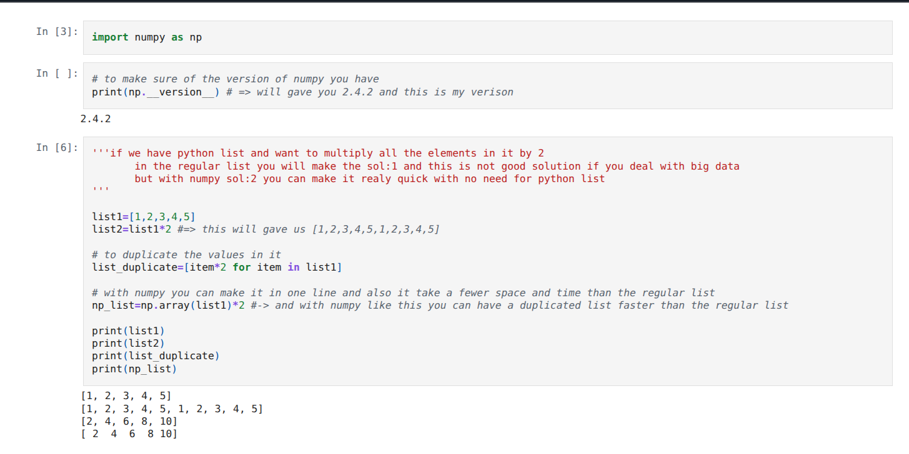

# to install the venv => python3 -m venv name.
# source name/bin/activate => to activate the venv.

### `why numpy and not python regular list?`
this is because numpy is has written in c so it's so fast compared to the regular python list 

## you will find the notes like this and it's so easy to understand if it's the first time to see numpy or you only want to make a revision

